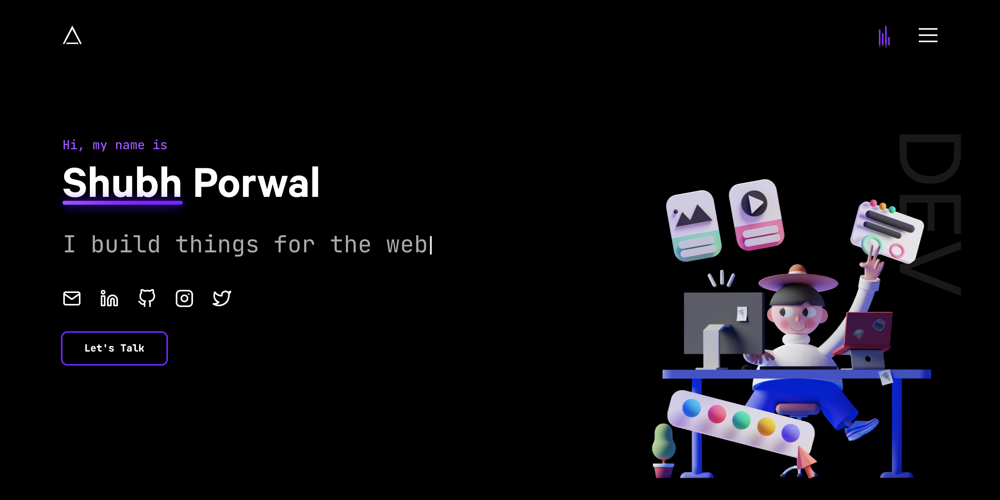

# Portfolio

👨‍🎓 A developer portfolio website built with Next.js, GSAP, Tailwind CSS, and React.

### ✨ [Source Code](https://github.com/Faizannkazi/Portfolio)

## Getting Started

In the project directory, you can run:

#### `bun install`

#### `bun dev`

Runs the app in the development mode.\
Open [`http://localhost:3000`](http://localhost:3000) to view it in the browser.

## Design

You can always draw inspiration from the design, and no, you don't have to give me credits for that.

## Forking

This repository is free to use and customize for your own portfolio projects.

## Star History

